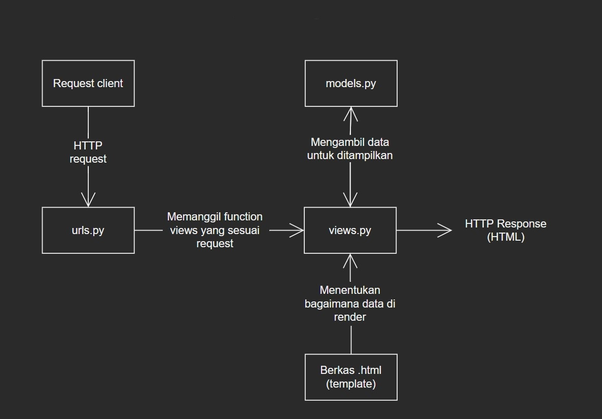

# README

### [Link Aplikasi Heroku](https://pbp-assignments-catalog.herokuapp.com/katalog/)


## Cara aplikasi memproses request _client_



Singkatnya, aplikasi ini akan memproses request dari user dengan pertama mencari _url_ yang menyimpan informasi yang diinginkan client pada file ```urls.py```. Setelah _url_ ditemukan, maka ```urls.py``` akan memanggil fungsi _view_ yang bersesuaian dengan _url_ tadi. Fungsi _view_ ini terletak pada file ```views.py```, dimana fungsi tersebut akan mengambil data-data yang akan ditampilkan dari file ```models.py``` dan akan mereturn fungsi render yang akan membaca ```katalog.html``` untuk menentukan bagaimana data akan ditampilkan, dan juga menampilkan data itu sendiri kepada client.

## Mengapa aplikasi di-_develop_ menggunakan virtual environment?

_Virtual environment_ sendiri merupakan _environment_ terisolasi yang digunakan Django untuk mengeksekusi sebuah aplikasi. Hal tersebut berarti perubahan-perubahan yang kita lakukan dalam sebuah _virtual environment_ hanya akan berlaku di dalamnya saja dan tidak mengubah pada _environment_ lain seperti contohnya instalasi Python lokal pada sistem operasi komputer yang digunakan. 

Dalam pengembangan aplikasi berbasis web, penggunaan _virtual environment_ penting agar tidak terjadi banyak konflik dalam pengembangan, pengeksekusian, dan juga _maintenance_ sebuah aplikasi. Dengan virtual environment, secara tidak langsung, aplikasi menjadi portabel dan praktis karena jalannya aplikasi tidak tergantung dengan sistem tempat aplikasi tersebut dijalankan, sehingga _versions, updates,_ dan _framework_ yang digunakan dapat terkontrol. Maka dari itu, hal-hal seperti _maintenance_ akan lebih mudah untuk dilakukan karena pengembangan tersentralisasi di satu _environment_, sehingga _developer_ tidak harus me-_maintain_ tiap _environment_ tempat aplikasi berjalan.

Pengembangan sebuah aplikasi web tanpa _virtual environment_ tetap bisa dilakukan, namun sangat tidak dianjurkan karena aplikasi web merupakan sesuatu yang kemungkinan akan memiliki banyak pengguna sehingga dapat menimbulkan berbagai masalah dan juga lebih susah untuk di-_maintain_ seperti yang telah dijelaskan diatas.

## Pengimplementasian aplikasi

Sebelum memulai, dinyalakan terlebih dahulu _virtual environment_ pada direktori project yang akan dikerjakan dan juga install requirements yang dibutuhkan project. Setelah itu, karena ```models.py``` sudah disediakan, dilakukan juga _migration_ untuk memuat model ke database Django lokal. Lalu, load juga data barang yang ada pada ```initial_catalog_data.json``` ke database Django lokal. Barulah diisi file-file yang rumpang.

### ```views.py```

File ini saya isi dengan fungsi ```show_catalog``` yang menerima parameter request dan mengembalikan fungsi render yang berfungsi untuk menampilkan html berisi data yang telah diambil pada fungsi dan disimpan di variabel ```data_katalog_item```.

```
...
def show_catalog(request):
    data_barang_catalog = CatalogItem.objects.all()
    context = {
        'list_barang': data_barang_catalog,
        'nama': 'Rayhan Putra Randi',
        'id': '2106705644'
    }
    return render(request, "katalog.html", context)
```

### ```urls.py``` (Routing)

Untuk routing, pada file ```project_django\urls.py``` ditambahkan sebuah elemen pada variabel ```urlpatterns``` agar program dapat mengambil data yang sesuai dengan request client sebagai berikut:
```
...
urlpatterns = [
    path('katalog/', include('katalog.urls')),
    path('admin/', admin.site.urls),
    path('', include('example_app.urls')),
]
```
Sementara itu, pada file ```katalog\urls.py```, ditambahkan sebuah elemen pada variabel ```urlpatterns``` juga yang berfungsi untuk memanggil fungsi ```show_catalog``` untuk menampilkan data yang telah dikumpulkan dan disimpan pada variabel di dalam fungsi tersebut seperti berikut:
```
...
urlpatterns = [
    path('', show_catalog, name='show_catalog')
]
```

### ```katalog.html``` (Template)

Pada file ini, ditambahkan sebuah loop dalam _table_ yang mengiterasi variabel ```list_barang```, dimana variabel tersebut menyimpan data-data yang ingin ditampilkan pada web. Data barang ditampilkan dengan cara memanggil attribut-attribut dari barang yang telah ditentukan pada file ```models.py``` untuk setiap barang yang diiterasi seperti berikut:
```
...

    <tr>
        <th>{{item.item_name}}</th>
        <th>{{item.item_price}}</th>
        <th>{{item.item_stock}}</th>
        <th>{{item.rating}}</th>
        <th>{{item.description}}</th>
        <th>{{item.item_url}}</th>
    </tr>
...
```

### _Deployment_

Proses ini sama seperti pada tutorial, yaitu melakukan ```git add```, ```git commit```, lalu ```git push``` untuk men- _deploy_ project ke repository github. Pada github, atur juga API key dan nama aplikasi yang ingin di deploy agar aplikasi bisa dibuka di web browser melalui Heroku.
 
##### _Rayhan Putra Randi | 2106705644 | PBP-A_

###### _sources_:
https://developer.mozilla.org/en-US/docs/Learn/Server-side/Django/Home_page

https://www.javatpoint.com/django-virtual-environment-setup#:~:text=The%20virtual%20environment%20is%20an,create%20an%20isolated%20Python%20environment
